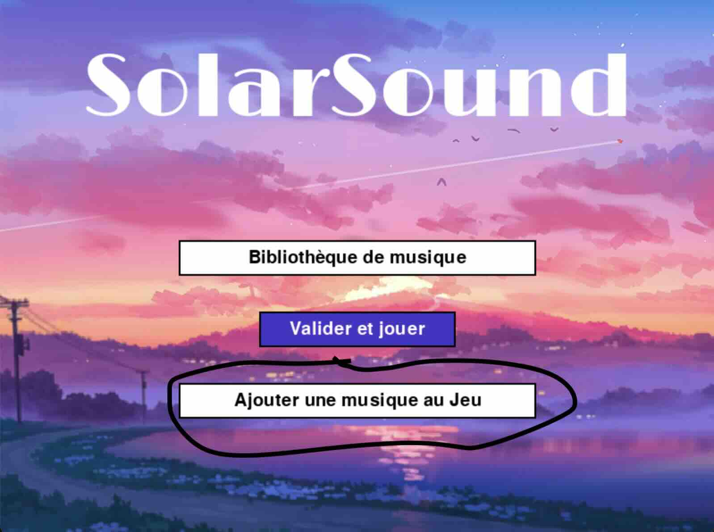
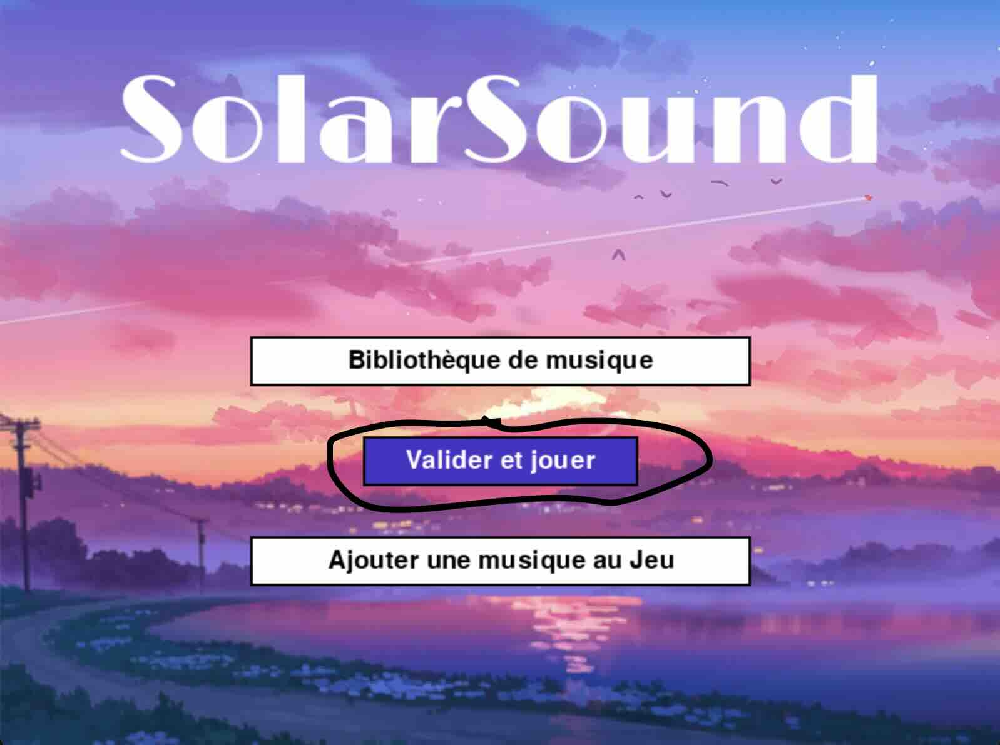
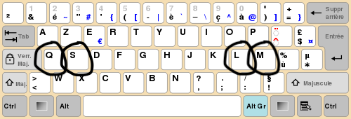

# Solar Sound

Solar Sound est un jeu de rythme génératif à 4 touches, développé en Python.

## Instructions d'installation :

Après avoir téléchargé le code source, suivez ces étapes :

1. **Installer les bibliothèques nécessaires :**
   - Si ce n'est pas déjà fait, utilisez les commandes suivantes dans votre terminal :
     - `pip install librosa`
     - `pip install pygame`
     - `pip install numpy`
     - `pip install scipy`
     - `pip install scikit-learn`
     - `pip install tk`

2. **Ouvrir le dossier du jeu :**
   - Utilisez votre IDE préféré (tel que VSCode ou Spyder) pour ouvrir le dossier contenant tous les fichiers `.py` et le dossier `assets`.

3. **Lancer le jeu :**
   - Lancez le jeu en exécutant `main.py`.
   - La fenêtre du jeu s'ouvrira, indiquant que vous êtes prêt à jouer !

## Règles du jeu de rythme :

### Avant de jouer :
1. **Télécharger ou choisir un fichier musical :**
   - Téléchargez un fichier MP3 *ou utilisez les MP3 fournis (pour un usage personnel uniquement) pour votre commodité.*

2. **Ajouter de la musique au jeu :**
   - Cliquez sur le bouton "Ajouter une musique au jeu" :
   
   
3. **Sélectionner le fichier téléchargé :**
   - Choisissez le fichier téléchargé.

4. **Ajouter à la bibliothèque musicale :**
   - Cliquez sur le bouton "Bibliothèque musicale" et sélectionnez le fichier téléchargé :
   

5. **Commencer à jouer :**
   - De retour sur le menu principal, cliquez sur le bouton "Valider et jouer" :
   
   - Dans le cas où vous avez choisi un nouveau fichier musical, une fois le chargement terminé, vous serez renvoyé au menu principal, et vous devrez donc cliquer à nouveau sur le bouton "Valider et jouer".

### Comment jouer :
- Votre musique sera représentée par des flèches descendant du haut de l'écran.
- Votre but est d'appuyer sur la touche correspondante de votre clavier lorsque la flèche est alignée avec la barre colorée en bas de l'écran.
- La flèche orientée vers l'est correspond à la touche "Q".
- La flèche orientée vers le nord correspond à la touche "S".
- La flèche orientée vers le sud correspond à la touche "L".
- La flèche orientée vers l'ouest correspond à la touche "M".
- Voici une image d'un clavier pour référence :
  
  
- Lorsque vous appuyez sur la touche au bon moment, la flèche disparaît et vous gagnez des points !
- Visez à toucher chaque note sans en manquer aucune pendant leur défilement sur l'écran. Rappelez-vous, une musique plus rapide signifie un défilement de notes plus rapide !
